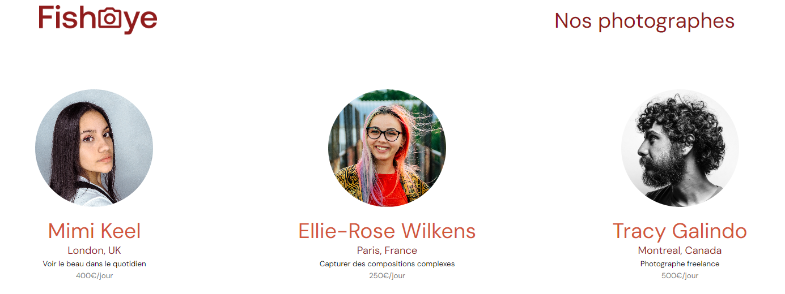

#  FishEye - fully accessible photographers app

## Presentation:

Figma models are available [here](https://www.figma.com/file/Q3yNeD7WTK9QHDldg9vaRl/UI-Design-FishEye-FR?node-id=0%3A1)

### Live Demo is available [here](https://zhannazucher.github.io/Front-End-Fisheye/index.html)

## Project goals:

#### 1. Create a fully accessible with keyboard or screen readers photographers platform conforming to WCAG
#### 2. Features to implement : 
	- Lightbox for photographer portfolio including photos and videos
	- Photographer contact form
	- Dropdown for portfolio sort on date / popularity / title
	- System updating the number likes of each media which reflects on the total number of likes of the photographer

## Local setup

1. Clone and/or fork this repository.
2. Then start your Live Server